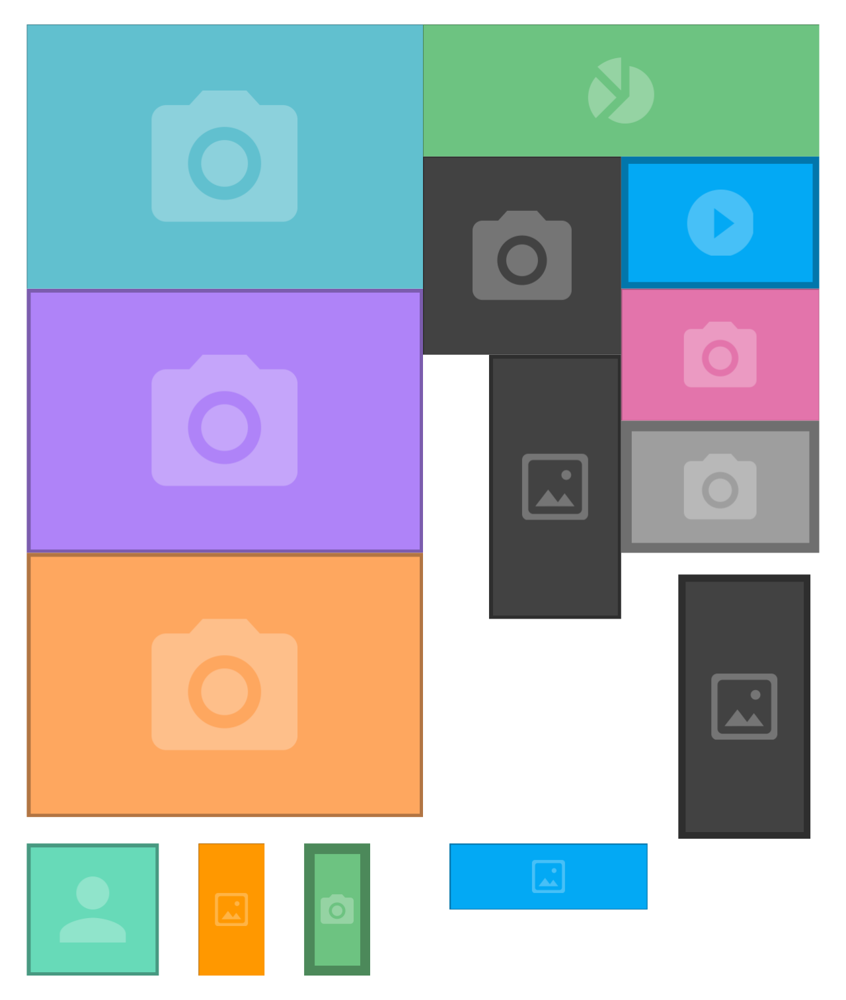

# Blank Image
This class allow you generate "blank" images on your page. It's good for developers for prepare mockup HTML.
For better performance, generated images are stored in cache folder (make sure to write access for cache folder).

## Usage
In your www server place files from this repository:
- **blank_image.php** file
- **cache** folder (make sure for write access)
- **resources** folder (with svg files)

In your HTML add **img** tag with **src** atributes as showing in the **Example** below.

## Example

``

## Parameters
- **height**: height of generated image (in px)
- **width**: width of generated image (in px)
- **fillcolor**: fill color of generated images (values from color1 to color14 or random for random color)
- **strokewidth**: width (in px) for the borders of the generated image
- **icon**: icon dislpayed in center of the blank image. (values:camera, chart, image, player, user. Default: camera)
