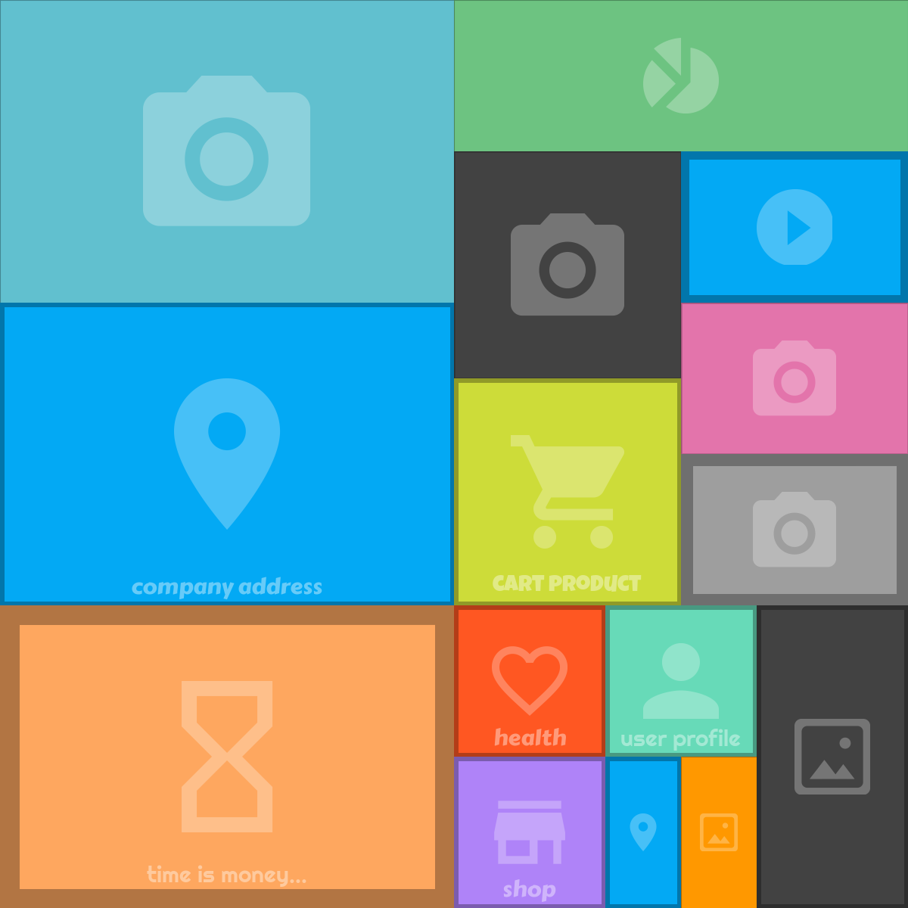

# Blank Image

Simple class to generate "blank" images in your page. It's good for developers for prepare mockup HTML.
For better performance, generated images are stored in cache folder.

## Usage

On your web server copy those files and folders from this repository:

- **blank_image.php** main file
- **cache** folder for storing cached images (make sure for write access to cache folder)
- **resources/svg** folder with svg icons
- **resources/fonts** folder with font files

In your HTML add **img** tag with **src** attribute as showing in the **Example** below.

## Example

``

## Parameters

- **height**: height of generated image (in px). If empty: 150.
- **width**: width of generated image (in px). If empty: 150.
- **fillcolor**: fill color of generated images. Values from `0` to `13` or `random` for random color. If empty: 0 (white).
- **strokewidth**: width (in px) for the borders of the generated image (optional).
- **icon**: icon showing in center of the blank image (optional). Values: `calendar`, `camera`, `cart`, `chart`, `hourglass`, `image`, `map_mark`, `player`, `store`, `user` or `random` for random icon.
- **text**: add text to image (optional).
- **font**: choose font for image text. Values: `abril`, `anton`, `bangers`, `boogaloo`, `carterone`, `dancingscript`, `fredericka`, `indieflower`, `oswald`, `luckiestguy`, `righteous`, `roboto` or `random` for random font.

## Other

You can use **showHelpImage()** method for generate helper image (with icons and font styles preview - see below).

## Changelog

**v1.2.1**

- Compatibility with PHP 8.0

**v1.2**

- Added example usage
- Show helper image if no parameters

**v1.1**

- Added new icons (calendar, cart, heart, hourglass, store)
- Added text to image
- Added method for delete all image files from cache folder
- Different types of fonts for image text
- Allow for showing blank image without any icon
- Fixed overwrite cache property declaration
- Removed unused methods
- Added method for generate helper image (with icons and fonts previews)

**v1.0**

- First release
